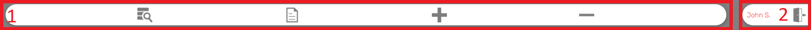
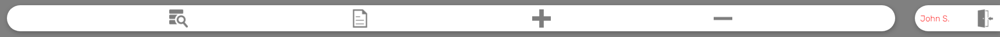
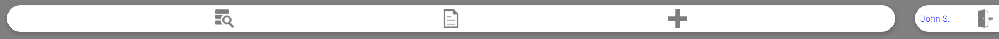
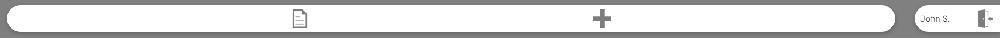
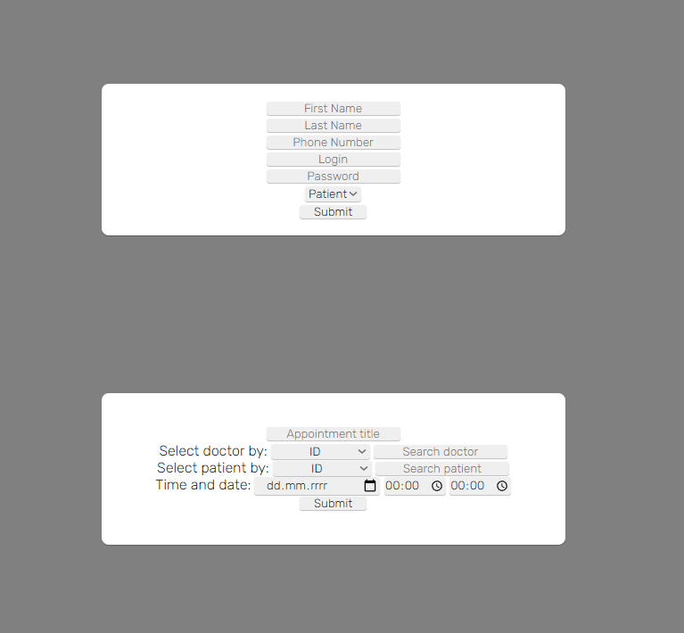
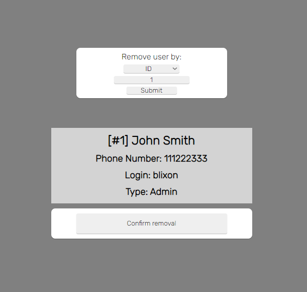
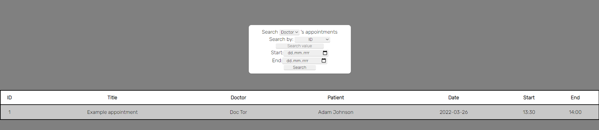
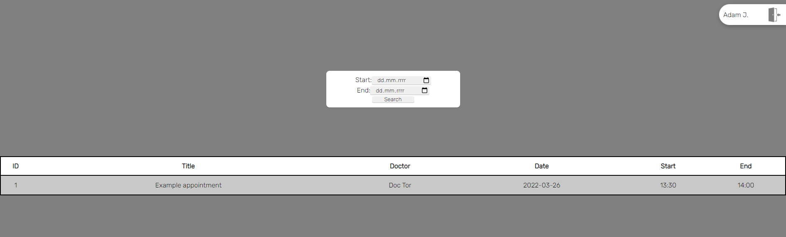
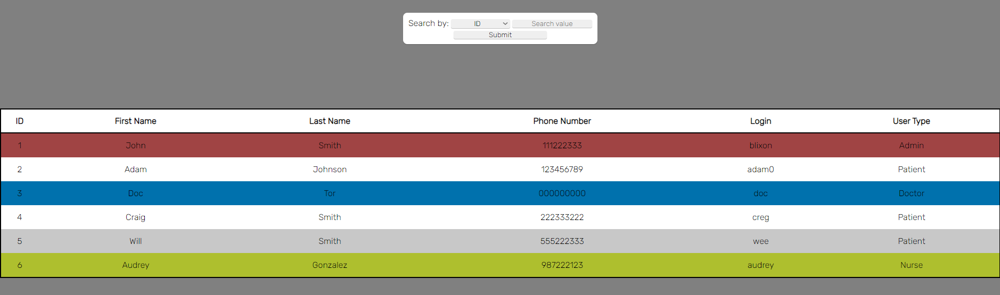
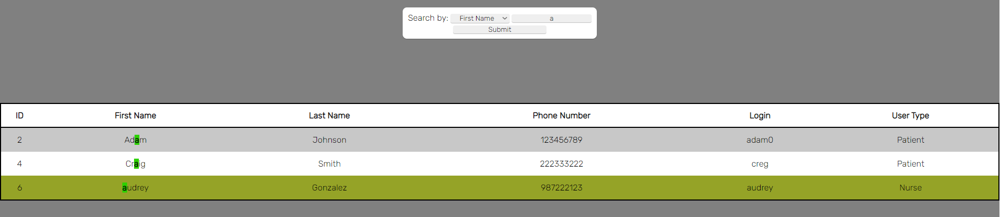

# Hospital Administration System

#### This README is split into three sections and a few subsections:

- [About](#grey_questionabout)
  
  - [What it taught me?](#bulbwhat-it-taught-me)

- [Setup](#bookssetup)
  
  - [Requirements](#gearrequirements)
  - [Configuration](#wrenchconfiguration)

- [Guide](#world_mapguide)
  
  - [Homepage](#househomepage)
  - [Login](#page_facing_uplogin)
  - [System](#computersystem)
    - [Navbar](#navbar)
    - [Roles](#roles)
    - [Tools](#tools)

## :grey_question:About

The purpose of this project was to make me learn basics of **PHP** with my prior knowledge of programming in other languages such as **C/C++**, **Javascript** and **Lua**.

Before i even wrote my first line of code in PHP, i realized that PHP is not so powerful without a database and therefore this project became more valuable to me.

### :bulb:What it taught me?

- **PHP basics**

- **SQL Code** *(helped in understanding)*

- Some **.htaccess** configuration code *(Apache)*

- **GIT** (learning more elements)

- **HTTP requests**

## :books:Setup

### :gear:Requirements:

| Technology        | Version             |
|:-----------------:|:-------------------:|
| **PHP**           | 8.0.0+              |
| **SQL Database**  | MySQL *(preferred)* |
| **Apache Server** | Version 2.2+        |

You can use XAMPP to run this project.

### :wrench:Configuration:

1. Once everything is installed you should go to the SQL Server and create database called `hospital` (case sensitive).
   
   - Optionally you can also create a user that has full rights <ins>ONLY</ins> to this database.

2. After that you should open `/logic/model.php` and configure first  7 lines of this PHP code: 
   
   ```php
   <?php
   $dbHostname = "localhost";
   $dbUsername = "root";
   $dbPassword = "";
   $dbName = "hospital";
   $dbPort = 3306;
   $db = new mysqli($dbHostname, $dbUsername, $dbPassword, $dbName, $dbPort);
   ```
   
   - If you just installed XAMPP you can skip this configuration step.

3. When you're done, you can place everything in `htdocs` folder of apache server, run both apache and database and move to the next step.

4. If you try to open the page, you should see this: 
   
   - Here you just need to fill all of the fields to create the admin account. Example:
     
     

5. Once that is done, you're finished with the configuration section. Now you can see guide to learn about the system.

## :world_map:Guide

- ## :house:Homepage
  
  When you go on the website you should be met with this screen: 
  
  This page is just some sample page to give some context to the whole project.
  
  It is made out of 4 pages accessible on top of the every page: Home, Offer, Contact and Login. All **3** of them are sample pages, except for **Login** which has it's own section.

- ## :page_facing_up:Login
  
  This is login page: 
  
  On top you have a button to go back to homepage and on the middle login form.
  
  *What are the credentials?* If you remember the setup page, there was **login** field and **password**. In my scenario ([Setup/Configuration](#wrenchconfiguration)) login is: `Blixon` and password: <code>····</code>. If by any accident you type invalid credentials, we've got you covered with simple error telling what's wrong. *For example, missing field:* 

- ## :computer:System
  
  - ## Navbar
    
    It is split into 2 parts as on the image: 
    
    1. **Tools** - They vary from priveleges to priveleges.
       
       - [List of all tools: **Search**, **Appointments**, **Add**, **Remove**]
    
    2. **Login** - It can be broken down into 2 elements.
       
       1. User's name, which is First name and first letter of Last name.
       
       2. Logout button to log out of the system.
  
  - ## Roles
    
    This section gives a short description of every role and what tools they can access, including image of navbar.
    
    1. **Admin** - He's a computer guy that does the computer stuff, fixes printers, etc.. Has access to every tool.
    
    2. **Doctor** - Fixes humans. Has access to: search, appointments and add. 
    
    3. **Nurse** - Helps doctors and something else, i don't know. Has access to: appointments and add. 
    
    4. **Patient** - Wants help from doctors. Has only access to appointments. 
  
  - ## Tools
    
    This section describes shortly about all the tools that you can access with the navbar.
    
    1.**ADD[:heavy_plus_sign:]** is a tool that allows to create new users, as well as add appointments. 
    
    Top part allows to create new user accounts, while bottom let's to add new appointments.
    
    2.**Remove[:heavy_minus_sign:]** tool is can remove users. 
    
    On top you can search user by: **ID**, **Phone number** or **Login**. Middle section lets you see if searched user is the desired one. Bottom is confirmation that you want to remove the user.
    
    3.**Appointments[:newspaper:]** is a bit more complex one. 
    
    The image above is the view from: **Doctor**, **Nurse** and **Admin**. Here you can search all appointment that are going to happen and those that happened already. But this specific view of hospital staff lets to search appointments by Doctors/Patients **ID**, **Phone number** or **Login** as well as the timestamp at which appointments were. If no timestamp is selected, the tool will show appointments for next 7 days (including current day). If only the starting date is selected, then tool will search all appointments from the starting date. If only ending date is selected, then every appointment back from the ending date will be seached. Everyone from the staff can lookup appointments of every registered doctor and patient.
    
    
    
    This view is from **Patients** perspective. Patient can only see his appointments and not a single thing more. Patient can only search his appointments. Same searching rules applies here. 
    
    No dates = 7 days ahead. 
    
    Stating date = Everything ahead of start. 
    
    End = Everything behind end date.
    
    4.**Seach[:mag:]** lets you see all information about registered users, except for password. 
    
    This tool lets you search users. You can search users by: **ID**, **First name**, **Last name**, **Phone number**, **Login** and **User type**. Users are colored by their role.
    
    Admin = RED
    
    Doctor = BLUE
    
    Nurse = YELLOW
    
    Patient = WHITE
    
    
    
    In this example you can see searched users by those with "a" in their names. It also highlights where searched text is in name.
